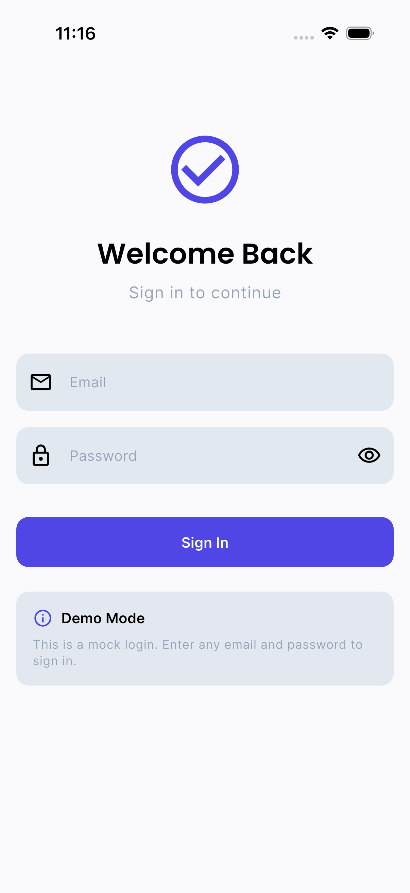
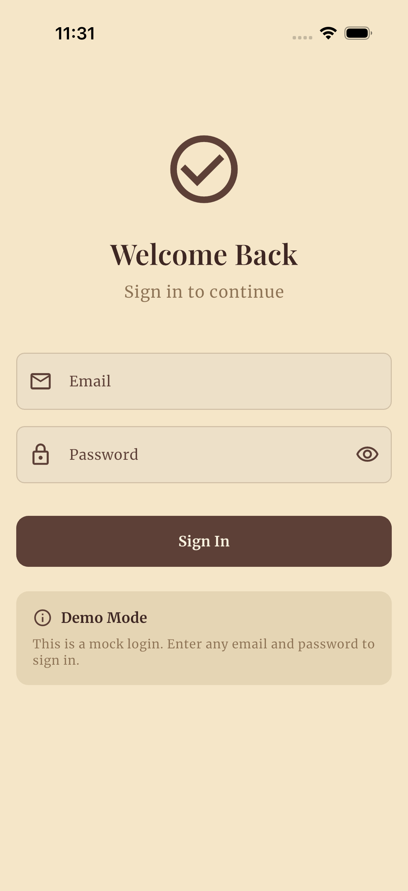
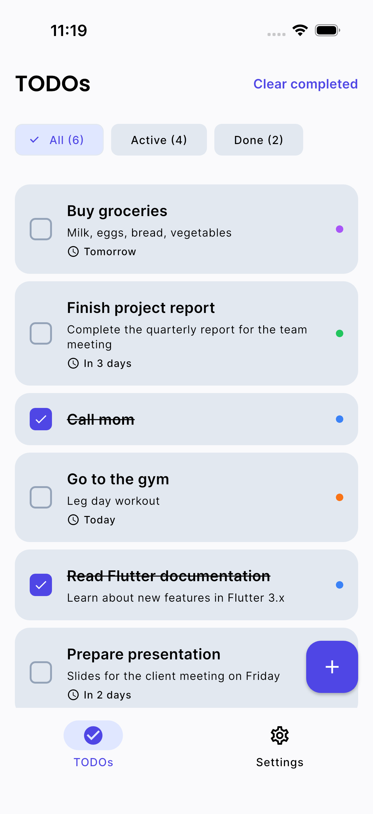
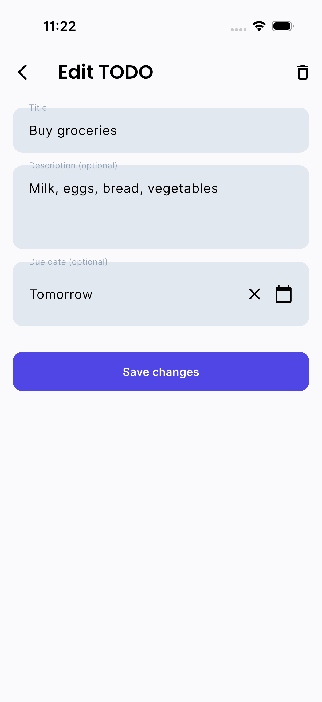
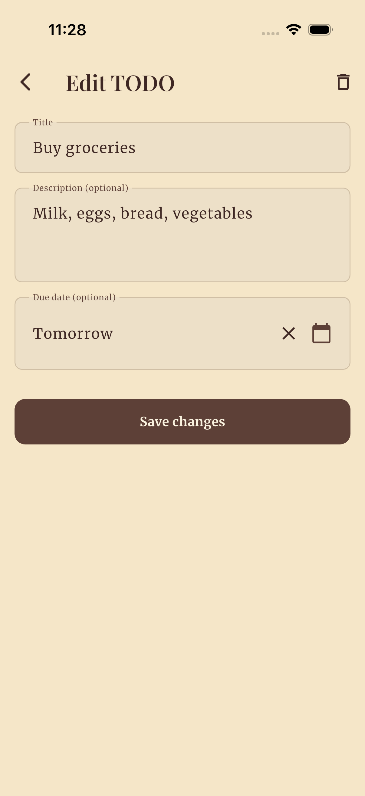
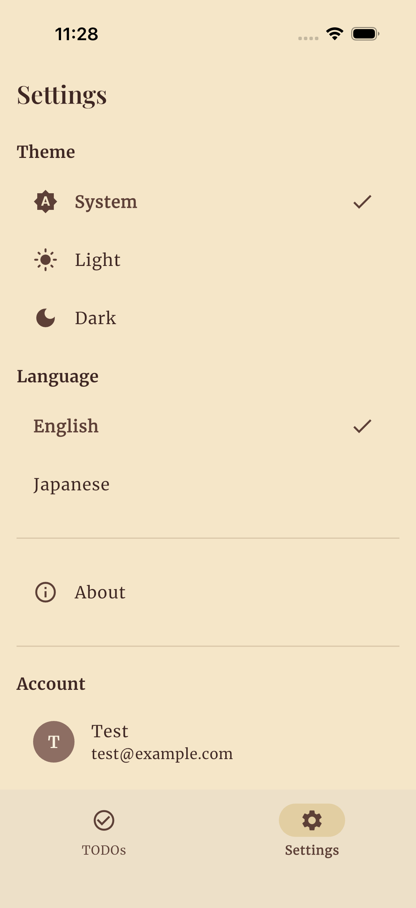

# UI Design Comparison - Antique Theme

## Overview

Modern UI design to Antique/Vintage theme transformation.

| Aspect | Before | After |
|--------|--------|-------|
| Background | Light gray/blue | Warm parchment (cream/beige) |
| Primary Color | Indigo (#4F46E5) | Dark Wood (#5D4037) |
| Secondary Color | Cyan (#0891B2) | Brass/Gold (#B8860B) |
| Typography | Poppins + Inter (Sans-serif) | Playfair Display + Merriweather (Serif) |
| Border Radius | 12-16px | 8-12px (more subtle) |

---

## Login Screen

| Before | After |
|--------|-------|
|  |  |

**Changes:**
- Background: Gray → Parchment cream
- Button: Indigo → Dark brown
- Input fields: Light blue fill → Warm beige with subtle border
- Icon: Blue circle → Brown circle
- Typography: Sans-serif → Serif

---

## TODO List Screen

| Before | After |
|--------|-------|
|  |  |

**Changes:**
- Background: Light gray → Warm parchment
- Cards: Blue-gray → Cream with subtle border
- Filter chips: Blue selection → Gold/brass selection
- FAB: Indigo → Dark brown
- Checkbox: Blue → Dark brown
- Category dots: Vibrant colors → Muted antique palette

---

## TODO Edit Screen

| Before | After |
|--------|-------|
|  |  |

**Changes:**
- Background: Light gray → Warm parchment
- Input fields: Blue-gray fill → Cream with border
- Button: Indigo → Dark brown
- Typography: Sans-serif → Elegant serif

---

## Settings Screen

| Before | After |
|--------|-------|
|  |  |

**Changes:**
- Background: Light gray → Warm parchment
- Navigation bar: Gray → Cream with gold indicator
- Icons: Blue → Brown
- Selection checkmarks: Blue → Brown
- Section headers: Blue-gray → Warm brown

---

## Theme Files Modified

| File | Purpose |
|------|---------|
| `lib/core/theme/app_colors.dart` | Parchment + dark wood color palette |
| `lib/core/theme/app_typography.dart` | Playfair Display + Merriweather fonts |
| `lib/core/theme/app_radius.dart` | Reduced radii for classic feel |
| `lib/core/theme/app_theme.dart` | Component-level theme integration |
| `.claude/skills/flutter-ui-design/SKILL.md` | Antique design guidelines |

---

## Design Concept

**Theme:** Classic study room / Old library aesthetic

- Parchment paper textures
- Dark wood tones
- Brass/bronze metallic accents
- Serif typography with classic elegance
